# EKS Terragrunt Infrastructure

> **Why This Project Exists:** As a full-stack developer expanding into platform engineering, I built this production-grade infrastructure to demonstrate deep understanding of the complete technology stack—from React components to Kubernetes deployment.

A production-ready infrastructure-as-code setup for deploying Amazon EKS clusters using Terragrunt and Terraform. This repository showcases platform engineering capabilities beyond typical application development, providing a modular, DRY (Don't Repeat Yourself) approach to managingFor detailed next steps, see [NextSteps.md](NextSteps.md) which contains a comprehensive production readiness roadmap.

## 🔗 **Related Projects**

This infrastructure platform is designed to deploy modern applications like:
- **AI-Powered Applications**: Next.js frontends with LLM integration and event-driven backends
- **Full-Stack SaaS Products**: React applications with AWS services integration
- **Microservices Architectures**: Multi-service applications with proper networking and security


## 🔄 Updating InfrastructureS infrastructure across multiple environments with comprehensive monitoring stack, security features, and automated documentation generation.

## 🎯 **Project Context & Skills Demonstrated**

This isn't just a learning exercise—it's production-ready infrastructure showing I understand the complete technology stack:

- **Platform Engineering**: Multi-environment automation with security-first architecture
- **Production Thinking**: Monitoring, observability, disaster recovery, and cost optimization
- **Security Expertise**: Pod Security Standards, Network Policies, RBAC, and secrets management
- **Scalability Design**: Auto-scaling, resource management, and performance optimization
- **DevOps Excellence**: Infrastructure as Code, GitOps readiness, and operational best practices

## 🏗️ Architecture Overview

This repository follows a modular architecture pattern that separates reusable Terraform modules from environment-specific configurations:

### Infrastructure Architecture


### Directory Structure

```
├── bootstrap/                 # Initial setup (S3, DynamoDB, Route53, IAM policies)
├── infrastructure-modules/    # Reusable Terraform modules
│   ├── vpc/                  # VPC with public/private subnets across AZs
│   ├── eks/                  # EKS cluster and managed node groups
│   ├── kubernetes-addons/    # Kubernetes add-ons (autoscaler, ALB controller)
│   ├── acm-certificate/      # SSL certificates for domains
│   └── route53/              # DNS hosted zone management
├── infrastructure/           # Environment-specific Terragrunt configurations
│   ├── dev/                 # Development environment
│   ├── staging/             # Staging environment
│   └── _envcommon/          # Shared provider configurations
└── scripts/                 # Automation and utility scripts
```

### Current Deployment Architecture

**Development Environment:**
- **Network**: 2-AZ VPC (us-east-1a, us-east-1b) with public/private subnets
- **EKS**: Single-node deployment for cost optimization (scales 1-5 nodes)
- **Domain**: `dev.example.com` with wildcard certificate (`*.dev.example.com`)
- **Cost**: Optimized for development with minimal resource usage

**Staging Environment:**
- **Network**: 2-AZ VPC (us-east-1a, us-east-1b) with public/private subnets
- **EKS**: Single-node deployment for cost optimization (scales 1-5 nodes)
- **Domain**: `staging.example.com` with wildcard certificate (`*.staging.example.com`)
- **Cost**: Optimized for staging with controlled resource usage

### Future Multi-AZ Enhancement Plans

**Planned Multi-AZ Deployment:**
- **Geolocation-based Routing**: Route53 geolocation routing for optimal performance
- **Regional Deployment**: Multiple regions with automated failover
- **Subdomain Strategy**:
  - `app.dev.example.com`, `tools.dev.example.com` for development services
  - `api.staging.example.com`, `admin.staging.example.com` for staging services
- **VPN Validation**: Test different regions via VPN to validate geolocation routing
- **Load Balancing**: Geographic load distribution for global scale

## 🚀 Features

### Infrastructure & Platform Engineering
- **Multi-Environment Support**: Separate configurations for dev, staging, and production
- **Modular Design**: Reusable Terraform modules for all components
- **DRY Configuration**: Terragrunt eliminates code duplication across environments
- **Remote State Management**: S3 backend with DynamoDB locking for state consistency
- **Cost-Optimized Deployment**: Single-node clusters with auto-scaling capabilities
- **Monitoring Stack**: Prometheus, Grafana, and CloudWatch integration (installed but requires configuration)

### Documentation & Development
- **Automated Documentation**: terraform-docs integration with pre-commit hooks
- **AI-Powered Documentation**: GitHub Copilot integration for intelligent module documentation
- **Live Documentation**: Always up-to-date documentation that syncs with code changes
- **Pre-commit Hooks**: Automatic code formatting, validation, and documentation updates

### Security & Networking
- **Security Best Practices**: Private subnets, IAM roles, and OIDC integration
- **Pod Security Standards**: Kubernetes security policies enforced across namespaces
- **Network Policies**: Network-level security controls and segmentation
- **Secrets Management**: AWS Secrets Manager integration with CSI driver
- **SSL/TLS**: Automated SSL certificate management with ACM
- **DNS Management**: Route53 hosted zone with external domain support
- **Network Isolation**: Proper subnet segmentation and security groups

### Kubernetes & Scalability
- **Auto-scaling**: Kubernetes cluster autoscaler for dynamic node scaling
- **Load Balancing**: AWS Load Balancer Controller for multi-app/service load balancing
- **DNS Automation**: External DNS for automatic Route53 record management
- **Storage**: EBS CSI driver for persistent volume support
- **Resource Management**: Resource quotas and limits configured for cost optimization
- **Cost-Controlled Scaling**: Configurable scaling limits for cost management

## � Key Implementation Examples

### Environment-Specific Configuration Pattern

```hcl
# infrastructure/dev/env.hcl
locals {
  env = "dev"
  region = "us-east-1"

  # Environment-specific sizing
  node_instance_types = ["t3a.large"]  # Cost-optimized for dev
  min_nodes = 1
  max_nodes = 3

  # Feature toggles
  enable_monitoring = true

  tags = {
    Environment = "dev"
    Project     = "eks-terragrunt-demo"
    ManagedBy   = "terragrunt"
    CostCenter  = "engineering"
  }
}
```

### Security-First Kubernetes Deployment

```yaml
# examples/secure-production-app.yaml
apiVersion: apps/v1
kind: Deployment
metadata:
  name: secure-web-app
  namespace: production
spec:
  template:
    spec:
      serviceAccountName: secrets-manager-sa
      securityContext:
        runAsNonRoot: true
        runAsUser: 1000
        seccompProfile:
          type: RuntimeDefault
      containers:
      - name: web-app
        image: nginx:1.25-alpine
        securityContext:
          allowPrivilegeEscalation: false
          readOnlyRootFilesystem: true
          capabilities:
            drop: ["ALL"]
        resources:
          limits:
            cpu: 500m
            memory: 512Mi
          requests:
            cpu: 250m
            memory: 256Mi
```

### Terragrunt Dependency Management

```hcl
# infrastructure/dev/kubernetes-addons/terragrunt.hcl
dependency "vpc" {
  config_path = "../vpc"
  mock_outputs = {
    vpc_id = "vpc-1234567890abcdef0"
  }
}

dependency "eks" {
  config_path = "../eks"
  mock_outputs = {
    eks_name = "demo"
    openid_connect_provider_arn = "arn:aws:iam::123456789012:oidc-provider/example"
  }
}

inputs = {
  env = include.env.locals.env
  eks_name = dependency.eks.outputs.eks_name
  vpc_id = dependency.vpc.outputs.vpc_id

  # Enable monitoring stack
  enable_monitoring = include.env.locals.enable_monitoring
  grafana_hostname = "grafana-${include.env.locals.env}.${dependency.bootstrap.outputs.domain_name}"

  # Security features
  enable_pod_security_standards = true
  enable_network_policies = true
  enable_secrets_management = true
}
```

### Infrastructure Module Pattern

```hcl
# infrastructure-modules/eks/1-eks.tf
resource "aws_eks_cluster" "main" {
  name     = "${var.env}-${var.cluster_name}"
  role_arn = aws_iam_role.cluster.arn
  version  = var.kubernetes_version

  vpc_config {
    subnet_ids              = var.subnet_ids
    endpoint_private_access = true
    endpoint_public_access  = var.endpoint_public_access
    public_access_cidrs    = var.public_access_cidrs
  }

  encryption_config {
    provider {
      key_arn = aws_kms_key.eks.arn
    }
    resources = ["secrets"]
  }

  enabled_cluster_log_types = [
    "api", "audit", "authenticator", "controllerManager", "scheduler"
  ]

  depends_on = [
    aws_iam_role_policy_attachment.cluster_AmazonEKSClusterPolicy,
    aws_cloudwatch_log_group.cluster
  ]

  tags = merge(var.tags, {
    Name = "${var.env}-${var.cluster_name}"
  })
}
```

## �📋 Prerequisites

Before getting started, ensure you have the following tools installed:

- [AWS CLI](https://aws.amazon.com/cli/) (configured with appropriate credentials)
- [Terraform](https://www.terraform.io/downloads.html) (>= 1.0)
- [Terragrunt](https://terragrunt.gruntwork.io/docs/getting-started/install/) (>= 0.50.0)
- [kubectl](https://kubernetes.io/docs/tasks/tools/install-kubectl/) (for cluster management)
- [Helm](https://helm.sh/docs/intro/install/) (for Kubernetes package management)

### Optional Development Tools

For enhanced development experience:

- [terraform-docs](https://terraform-docs.io/) (automatic documentation generation)
- [pre-commit](https://pre-commit.com/) (code quality and validation hooks)
- [GitHub CLI with Copilot](https://cli.github.com/) (AI-powered documentation)
- [tflint](https://github.com/terraform-linters/tflint) (Terraform linting)

**Quick setup for development tools:**
```bash
# Run the setup script (installs pre-commit, terraform-docs, tflint)
./scripts/setup-precommit.sh
```

## 🛠️ Quick Start

### 1. Bootstrap the Infrastructure

First, create the foundational infrastructure including S3, DynamoDB, Route53, and shared IAM policies:

```bash
cd bootstrap

# Configure your domain
cp domain.auto.tfvars.example domain.auto.tfvars
# Edit domain.auto.tfvars with your actual domain name

# Deploy bootstrap infrastructure
terragrunt init
terragrunt plan
terragrunt apply

# Get nameservers for domain configuration
terragrunt output hosted_zone_name_servers
```

**Important**: Update your domain registrar with the nameservers from the output above.

### 2. Configure Domain DNS

Before proceeding, configure your domain's nameservers:

1. **Log into your domain registrar** (Namecheap, GoDaddy, etc.)
2. **Find DNS/Nameserver settings** for your domain
3. **Change to Custom DNS** and enter the 4 AWS nameservers
4. **Wait for propagation** (15 minutes to 48 hours)

Verify DNS propagation:
```bash
# Check if your domain resolves to AWS nameservers
nslookup -type=NS your-domain.com
```
dig NS your-domain.com
```

### 3. Deploy Infrastructure

Choose your target environment (dev or staging) and deploy the infrastructure:

```bash
# Deploy VPC
cd infrastructure/staging/vpc
terragrunt plan
terragrunt apply

# Deploy EKS cluster
cd ../eks
terragrunt plan
terragrunt apply

# Deploy SSL certificates (requires DNS to be configured)
cd ../acm-certificate
terragrunt plan
terragrunt apply

# Deploy Kubernetes add-ons with Load Balancer Controller
cd ../kubernetes-addons
terragrunt plan
terragrunt apply
```

### 3. Configure kubectl

After the EKS cluster is deployed, configure kubectl to access your cluster:

```bash
aws eks update-kubeconfig --region us-east-1 --name staging-demo
```

### 4. Deploy Sample Application

Deploy a sample nginx application to validate your cluster:

```bash
kubectl apply -f examples/external-dns-example.yaml
kubectl get pods
```

### 5. Verify Infrastructure

After deploying your infrastructure, you can validate it by:

```bash
# Check cluster status
kubectl get nodes
kubectl get pods --all-namespaces

# Verify monitoring stack (Prometheus & Grafana are installed)
kubectl get pods -n monitoring

# Check security features
kubectl get networkpolicies --all-namespaces
kubectl get secretproviderclass --all-namespaces

# Verify DNS and load balancer setup
kubectl get services --all-namespaces
kubectl get ingress --all-namespaces
```

### 6. Deploy Sample Applications

Deploy sample applications to validate your cluster:

```bash
# Basic application deployment
kubectl apply -f examples/external-dns-example.yaml

# Validate External DNS is working
./scripts/validate-external-dns.sh example.com dev

# Check DNS records
dig app.dev.example.com
dig api.dev.example.com
```

## 📁 Directory Structure

### Infrastructure Modules (`infrastructure-modules/`)

Contains reusable Terraform modules with auto-generated documentation:

- **`vpc/`**: Creates VPC with public/private subnets, NAT gateways, and route tables
- **`eks/`**: Provisions EKS cluster, managed node groups, and IAM roles
- **`kubernetes-addons/`**: Installs essential Kubernetes add-ons (autoscaler, ALB controller, External DNS, monitoring)
- **`acm-certificate/`**: Manages SSL/TLS certificates for domains
- **`route53/`**: DNS hosted zone management and configuration

Each module includes comprehensive terraform-docs generated documentation with:
- Requirements and provider versions
- All input variables with descriptions and types
- All outputs with descriptions
- Resource listings with links to AWS documentation

### Infrastructure Configurations (`infrastructure/`)

Environment-specific Terragrunt configurations:

- **`dev/`**: Development environment settings (cost-optimized single node)
- **`staging/`**: Staging environment settings (cost-optimized single node)
- **`_envcommon/`**: Shared provider configurations and common resources
- **`terragrunt.hcl`**: Root Terragrunt configuration with remote state setup

### Bootstrap Infrastructure (`bootstrap/`)

Initial setup for foundational AWS resources:

- **S3 Backend**: Terraform state storage with versioning and encryption
- **DynamoDB**: State locking table for concurrent access protection
- **Route53**: DNS hosted zone for domain management
- **IAM Policies**: Basic permissions and service-linked roles

### Automation & Scripts (`scripts/`)

Development and operational automation:

- **`setup-precommit.sh`**: Installs and configures pre-commit hooks with terraform-docs
- **`update-readmes.sh`**: Regenerates all module documentation with terraform-docs
- **`ai-docs-generator.sh`**: AI-powered documentation using GitHub Copilot
- **`validate-external-dns.sh`**: DNS validation and testing utilities
- **`sanitize-sensitive-data.sh`**: Security utilities for data sanitization

### Key Configuration Files

- **`env.hcl`**: Environment-specific variables and naming
- **`terragrunt.hcl`**: Service-specific configurations and dependencies
- **`aws_provider.tf`**: AWS provider configuration template
- **`helm_provider.tf`**: Helm provider configuration template

## 🔧 Configuration

### Environment Variables

Each environment has its own `env.hcl` file defining:

```hcl
locals {
    env = "staging"  # Environment name used for resource naming
}
```

### EKS Configuration

The EKS module supports customizable:

- **Kubernetes Version**: Specify EKS version (e.g., "1.33")
- **Node Groups**: Configure instance types, scaling, and capacity type
- **Networking**: VPC and subnet configuration
- **Add-ons**: Cluster autoscaler, monitoring, logging
- **IRSA**: IAM Roles for Service Accounts integration

### VPC Configuration

The VPC module creates:

- **Public Subnets**: For load balancers and NAT gateways (10.0.1.0/24, 10.0.2.0/24)
- **Private Subnets**: For EKS nodes and applications (10.0.11.0/24, 10.0.12.0/24)
- **Internet Gateway**: For internet access
- **NAT Gateways**: For private subnet internet access (one per AZ)
- **Route Tables**: Proper routing for public and private subnets

### Kubernetes Add-ons Configuration

The kubernetes-addons module includes:

- **Cluster Autoscaler**: Automatic node scaling based on pod requirements
- **AWS Load Balancer Controller**: ALB/NLB provisioning for ingress
- **External DNS**: Automatic Route53 record management for services
- **EBS CSI Driver**: Persistent volume support for stateful applications
- **Pod Security Standards**: Kubernetes security policies enforced across namespaces
- **Network Policies**: Network-level security controls and segmentation
- **Secrets Management**: AWS Secrets Manager integration with CSI driver
- **Monitoring Stack**: Prometheus, Grafana, and CloudWatch integration (deployed but requires configuration)
- **Resource Quotas**: Namespace-level resource limits and quotas

### Documentation Configuration

The project uses automated documentation generation:

- **terraform-docs**: Generates comprehensive module documentation
- **Pre-commit hooks**: Automatically updates docs on every commit
- **AI documentation**: GitHub Copilot integration for intelligent explanations
- **Configuration**: `.terraform-docs.yml` defines documentation format and structure

## 🔐 Security Features

- **Private Node Groups**: EKS nodes run in private subnets with no direct internet access
- **IAM Roles**: Least-privilege access with service-linked roles and IRSA
- **OIDC Integration**: Kubernetes service accounts with AWS IAM integration
- **Pod Security Standards**: Enforced security policies across all namespaces
- **Network Policies**: Network-level security controls and micro-segmentation
- **Secrets Management**: AWS Secrets Manager integration via CSI driver
- **Resource Quotas**: Namespace-level resource limits to prevent resource exhaustion
- **Network Security**: Security groups with minimal required access
- **Encryption**: EKS secrets encryption and EBS volume encryption

## 🔍 Monitoring and Observability

The infrastructure includes a comprehensive monitoring stack that is deployed but requires configuration:

### Monitoring Architecture

```mermaid
graph TB
    subgraph "EKS Cluster"
        subgraph "Monitoring Namespace"
            PROM[Prometheus Server<br/>📊 Metrics Storage]
            GRAF[Grafana<br/>📈 Visualization]
            AM[AlertManager<br/>🚨 Alert Routing]
            NE[Node Exporter<br/>📋 Node Metrics]
        end

        subgraph "Application Pods"
            APP1[App Pod 1<br/>📱 /metrics]
            APP2[App Pod 2<br/>📱 /metrics]
            APP3[App Pod 3<br/>📱 /metrics]
        end

        subgraph "System Components"
            KUBELET[Kubelet<br/>⚙️ Node Metrics]
            CADVISOR[cAdvisor<br/>📦 Container Metrics]
            APISER[API Server<br/>🎛️ Cluster Metrics]
        end
    end

    subgraph "AWS Services"
        CW[CloudWatch<br/>☁️ AWS Metrics]
        SES[AWS SES<br/>📧 Email Alerts]
        SLACK[Slack Webhook<br/>💬 Notifications]
        SMS[AWS SNS<br/>📱 SMS Alerts]
    end

    subgraph "External Access"
        USER[Users<br/>👥 Dashboard Access]
        DEV[Developers<br/>🔧 Debug/Monitor]
        OPS[Operations<br/>🛠️ Incident Response]
    end

    %% Data Flow
    APP1 --> PROM
    APP2 --> PROM
    APP3 --> PROM
    KUBELET --> PROM
    CADVISOR --> PROM
    APISER --> PROM
    NE --> PROM
    CW --> PROM

    PROM --> GRAF
    PROM --> AM

    AM --> SES
    AM --> SLACK
    AM --> SMS

    USER --> GRAF
    DEV --> GRAF
    OPS --> GRAF

    %% Styling
    classDef prometheus fill:#e6522c,stroke:#333,stroke-width:2px,color:#fff
    classDef grafana fill:#f46800,stroke:#333,stroke-width:2px,color:#fff
    classDef aws fill:#ff9900,stroke:#333,stroke-width:2px,color:#fff
    classDef app fill:#326ce5,stroke:#333,stroke-width:2px,color:#fff
    classDef users fill:#4caf50,stroke:#333,stroke-width:2px,color:#fff

    class PROM,AM,NE prometheus
    class GRAF grafana
    class CW,SES,SMS aws
    class APP1,APP2,APP3,KUBELET,CADVISOR,APISER app
    class USER,DEV,OPS users
```



### Deployed Components
- **Prometheus**: Metrics collection and storage with 30-day retention (dev: 15-day)
- **Grafana**: Visualization dashboard with AWS Secrets Manager integration
- **AlertManager**: Alert routing and management (requires webhook configuration)
- **CloudWatch Integration**: AWS service metrics and logging
- **Node Exporter**: Node-level metrics collection
- **Metrics Server**: Pod and node metrics collection for HPA

### Monitoring Features
- **ClusterAutoscaler**: Automatic node scaling based on pod requirements
- **AWS Load Balancer Controller**: Efficient ingress management with ALB/NLB provisioning
- **Cost Monitoring**: Resource usage tracking and scaling metrics
- **External DNS**: Automatic DNS record management with monitoring
- **EBS CSI Driver**: Persistent volume metrics and monitoring
- **Pod Security**: Security policy monitoring and enforcement
- **Network Policies**: Network traffic monitoring and security
- **Resource Quotas**: Namespace-level resource monitoring and limits

### Next Steps Required
The monitoring stack is installed but needs configuration:
- Configure Grafana dashboards and data sources
- Set up AlertManager notification webhooks
- Configure CloudWatch log groups and retention
- Set up application-specific monitoring

### Documentation and Development Experience

- **Auto-generated Documentation**: Every module has comprehensive terraform-docs generated documentation
- **Pre-commit Validation**: Automatic code formatting, linting, and documentation updates
- **AI-Powered Insights**: GitHub Copilot integration for intelligent code explanations
- **Comprehensive Examples**: Secure production application templates and configurations
- **Validation Scripts**: Infrastructure validation and monitoring utilities

## 🚀 Deployment Workflow

### Deployment Dependencies Flow

```mermaid
graph TD
    BOOT[1. Bootstrap<br/>🏗️ S3, DynamoDB, Route53<br/>IAM Policies]

    subgraph "Environment Deployment"
        VPC[2. VPC<br/>🌐 Networking Infrastructure<br/>Subnets, NAT, IGW]

        CERT[3. ACM Certificate<br/>🔒 SSL/TLS Certificate<br/>DNS Validation]

        EKS[4. EKS Cluster<br/>☸️ Control Plane<br/>Managed Node Groups]

        ADDONS[5. Kubernetes Add-ons<br/>🔧 Monitoring, Security<br/>Load Balancer, DNS]
    end

    APPS[6. Applications<br/>📱 Workload Deployment<br/>Services, Ingress]

    %% Dependencies
    BOOT --> VPC
    BOOT --> CERT
    VPC --> EKS
    EKS --> ADDONS
    CERT --> ADDONS
    ADDONS --> APPS

    %% Styling
    classDef bootstrap fill:#ff6b6b,stroke:#333,stroke-width:3px,color:#fff
    classDef infrastructure fill:#4ecdc4,stroke:#333,stroke-width:2px,color:#fff
    classDef applications fill:#45b7d1,stroke:#333,stroke-width:2px,color:#fff

    class BOOT bootstrap
    class VPC,CERT,EKS,ADDONS infrastructure
    class APPS applications
```



### Single Environment Deployment

```bash
# Deploy all components in order (updated syntax for Terragrunt 0.50+)
cd infrastructure/staging
terragrunt plan --all    # Review all changes
terragrunt apply --all   # Deploy all components
```

### Component-Specific Deployment

```bash
# Deploy only VPC
cd infrastructure/staging/vpc
terragrunt apply

# Deploy only EKS (requires VPC)
cd infrastructure/staging/eks
terragrunt apply
```

### Dependency Management

Terragrunt automatically handles dependencies between components:

- EKS depends on VPC (uses VPC outputs for subnets)
- Kubernetes add-ons depend on EKS (uses EKS outputs for cluster info)

## 📚 Documentation & Development Workflow

This project features automated documentation generation and developer-friendly workflows:

### Automated Documentation

- **terraform-docs Integration**: Every module automatically generates comprehensive documentation
- **Pre-commit Hooks**: Documentation updates automatically on every commit
- **AI-Powered Insights**: GitHub Copilot integration for intelligent code explanations
- **Live Documentation**: Documentation always stays in sync with code changes
- **State Consistency**: Scripts to validate Terragrunt state across environments

### Documentation Structure

Each module includes:
- **Requirements**: Provider versions and dependencies
- **Providers**: Configured providers with versions
- **Resources**: All AWS resources with links to documentation
- **Inputs**: Variables with descriptions, types, defaults, and requirements
- **Outputs**: All outputs with clear descriptions

### Developer Setup

Get started with the full development environment:

```bash
# Install all development tools
./scripts/setup-precommit.sh

# This installs:
# - pre-commit (code quality hooks)
# - terraform-docs (documentation generation)
# - tflint (Terraform linting)
# - GitHub Copilot CLI (AI assistance)
```

### Pre-commit Features

When you commit code, pre-commit automatically:
- **Formats Terraform code** with `terraform fmt`
- **Validates Terraform syntax** with `terraform validate`
- **Updates documentation** with `terraform-docs`
- **Runs linting** with `tflint` for best practices
- **Formats Terragrunt files** with `terragrunt hclfmt`
- **Checks for security issues** and code quality

### AI-Powered Documentation

The project includes AI-enhanced documentation:
- **Intelligent explanations** of complex Terraform configurations
- **Architecture insights** powered by GitHub Copilot
- **Usage examples** and best practices
- **Security recommendations** and optimization tips

Example of viewing module documentation:
```bash
# View EKS module documentation
cat infrastructure-modules/eks/README.md

# View VPC module documentation
cat infrastructure-modules/vpc/README.md

# All modules include terraform-docs generated sections
```

## � Next Steps: Configuration & Production Readiness

Your EKS infrastructure is deployed with all core components, but several services need configuration to be fully operational:

### 1. Configure Monitoring Stack (Highest Priority)

The Prometheus and Grafana monitoring stack is installed but needs configuration:

```bash
# Access Grafana (get admin password from AWS Secrets Manager)
kubectl port-forward -n monitoring svc/kube-prometheus-stack-grafana 3000:80

# Configure Grafana data sources and dashboards
# - Add Prometheus data source (http://kube-prometheus-stack-prometheus:9090)
# - Import Kubernetes cluster dashboards
# - Set up custom application dashboards
```

### 2. Set Up AlertManager Notifications

Configure AlertManager to send notifications:

```bash
# Edit AlertManager configuration
kubectl edit secret -n monitoring alertmanager-kube-prometheus-stack-alertmanager

# Add Slack/email webhook configurations
# Configure routing rules for different alert severities
```

### 3. Configure Secrets Management

Enable the example SecretProviderClass to start using AWS Secrets Manager:

```bash
# Enable example secret provider class
cd infrastructure/dev/kubernetes-addons
# Set create_example_secret_provider_class = true in terragrunt.hcl
terragrunt apply
```

### 4. Deploy Production Applications

Use the provided secure application template:

```bash
# Deploy secure production app example
kubectl apply -f examples/secure-production-app.yaml

# Deploy External DNS example
kubectl apply -f examples/external-dns-example.yaml
```

### 5. Additional Configuration

- **CloudWatch Logs**: Configure log groups and retention policies
- **Network Policies**: Customize network segmentation rules
- **Resource Quotas**: Adjust namespace resource limits
- **Backup Strategy**: Implement EBS volume backup policies
- **Disaster Recovery**: Set up cross-region backup and restore procedures

For detailed next steps, see [NextSteps.md](NextSteps.md) which contains a comprehensive production readiness roadmap.

## �🔄 Updating Infrastructure

To update infrastructure:

1. **Modify configurations**: Update relevant Terragrunt or module configuration
2. **Review changes**: Run `terragrunt plan` to review changes
3. **Apply updates**: Run `terragrunt apply` to apply changes
4. **Documentation**: Pre-commit hooks automatically update documentation

### Module Development Workflow

For module updates:

1. **Edit module code** in `infrastructure-modules/`
2. **Documentation auto-updates** via pre-commit hooks when you commit
3. **Deploy updated modules** by running `terragrunt apply` in environment directories
4. **Validate changes** using the testing suite

### Documentation Workflow

The project uses automated documentation:

- **terraform-docs**: Automatically generates module documentation from code
- **Pre-commit hooks**: Updates documentation on every commit
- **AI insights**: GitHub Copilot provides intelligent explanations
- **Manual regeneration**: Use `./scripts/update-readmes.sh` to regenerate all docs

```bash
# Regenerate all module documentation
./scripts/update-readmes.sh

# Set up pre-commit hooks for automatic updates
./scripts/setup-precommit.sh

# View current documentation
# Each module's README.md contains comprehensive terraform-docs sections
```

## 🗑️ Cleanup

To destroy infrastructure:

```bash
# Destroy in reverse order
cd infrastructure/staging/kubernetes-addons
terragrunt destroy

cd ../eks
terragrunt destroy

cd ../vpc
terragrunt destroy
```

Or destroy all at once:

```bash
cd infrastructure/staging
terragrunt destroy --all --non-interactive
```

## 🆘 Troubleshooting

### Infrastructure Issues

**Terragrunt command not found**
```bash
brew install terragrunt
```

**kubectl cannot connect to cluster**
```bash
aws eks update-kubeconfig --region us-east-1 --name [CLUSTER_NAME]

# Verify connection
kubectl get nodes
kubectl cluster-info
```

**State lock conflicts**
```bash
terragrunt force-unlock [LOCK_ID]

# Check lock status
aws dynamodb scan --table-name eks-terragrunt-terraform-locks
```

**Clear Terragrunt caches**
```bash
find . -name ".terragrunt-cache" -type d -exec rm -rf {} +
```

### Kubernetes Debugging

**Check cluster health**
```bash
# Node status
kubectl get nodes -o wide

# Pod issues
kubectl get pods --all-namespaces | grep -v Running

# Describe problematic pods
kubectl describe pod [POD_NAME] -n [NAMESPACE]

# Check logs
kubectl logs [POD_NAME] -n [NAMESPACE] --previous
```

**Monitoring stack issues**
```bash
# Check monitoring namespace
kubectl get all -n monitoring

# Grafana admin password
aws secretsmanager get-secret-value \
  --secret-id "eks-terragrunt-grafana-admin-password-dev" \
  --query SecretString --output text | jq -r '.password'

# Port forward to Grafana
kubectl port-forward -n monitoring svc/kube-prometheus-stack-grafana 3000:80
```

**Load balancer issues**
```bash
# Check ALB controller
kubectl get pods -n kube-system | grep aws-load-balancer-controller

# Check ingress status
kubectl get ingress --all-namespaces

# Describe ingress for events
kubectl describe ingress [INGRESS_NAME] -n [NAMESPACE]
```

### Development Tools

**Pre-commit hooks not working**
```bash
# Reinstall pre-commit hooks
./scripts/setup-precommit.sh

# Or manually install
pre-commit install

# Run on all files
pre-commit run --all-files
```

**terraform-docs not updating**
```bash
# Manually regenerate documentation
./scripts/update-readmes.sh

# Check terraform-docs installation
terraform-docs --version
```

**Documentation out of sync**
```bash
# Force regenerate all module documentation
./scripts/update-readmes.sh

# Run pre-commit on all files
pre-commit run --all-files
```
