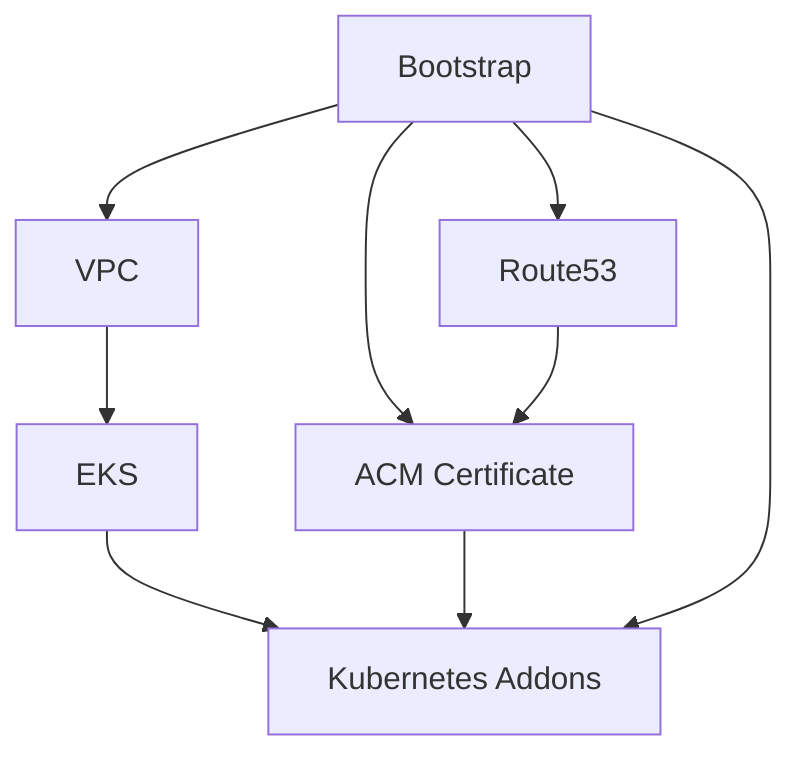

# Infrastructure Modules

Reusable Terraform modules for building production-ready EKS platform infrastructure with security best practices, multi-AZ deployment, and comprehensive testing support.

## Module Structure

```
infrastructure-modules/
├── vpc/                    # VPC with multi-AZ networking foundation
├── eks/                    # EKS cluster with managed node groups
├── kubernetes-addons/      # Cluster autoscaler and AWS Load Balancer Controller
├── acm-certificate/        # SSL/TLS certificate management
└── route53/               # DNS hosted zone management
```

## Module Dependencies

**Layered Architecture with Clear Dependencies**:



1. **Bootstrap**: Foundational resources (S3, DynamoDB, Route53, IAM policies)
2. **VPC**: Multi-AZ networking foundation (public/private subnets, NAT gateways)
3. **Route53**: DNS hosted zone management (depends on Bootstrap)
4. **ACM Certificate**: SSL certificates (depends on Route53 and Bootstrap)
5. **EKS**: Kubernetes cluster with OIDC (depends on VPC)
6. **Kubernetes Addons**: Cluster management tools (depends on EKS, Bootstrap, ACM)

## Design Principles

### Infrastructure as Code Best Practices
- **Environment Agnostic**: Parameterized for multi-environment deployment
- **Composable**: Single responsibility modules with clear interfaces
- **Immutable**: Infrastructure treated as disposable and reproducible
- **Versioned**: All modules support semantic versioning

### Production Readiness
- **Security by Design**: IAM least privilege, private subnets, security groups
- **High Availability**: Multi-AZ deployment across availability zones
- **Scalability**: Auto-scaling groups and cluster autoscaler integration
- **Monitoring**: CloudWatch integration and comprehensive logging

### AWS Well-Architected Framework
- **Operational Excellence**: Automated deployments and comprehensive testing
- **Security**: Defense in depth, encryption at rest and in transit
- **Reliability**: Multi-AZ deployment, auto-recovery mechanisms
- **Performance Efficiency**: Optimized instance types and resource allocation
- **Cost Optimization**: Right-sizing, auto-scaling, and cost monitoring

## Module Documentation

### [VPC Module](vpc/README.md)
Multi-AZ VPC with public and private subnets, NAT gateways, and proper subnet tagging for EKS and load balancer integration.

**Key Features:**
- Multi-AZ deployment (2-3 availability zones)
- Public subnets for load balancers and NAT gateways
- Private subnets for EKS worker nodes
- Proper subnet tagging for EKS and ALB discovery
- VPC Flow Logs for network monitoring
- Cost-optimized NAT gateway configuration

### [EKS Module](eks/README.md)
Production-ready EKS cluster with managed node groups, OIDC provider, and security best practices.

**Key Features:**
- EKS cluster with latest Kubernetes version
- Managed node groups with auto-scaling
- OIDC provider for service account integration
- Proper IAM roles and policies
- Private API endpoint configuration
- CloudWatch logging integration

### [Kubernetes Addons Module](kubernetes-addons/README.md)
Essential Kubernetes cluster management tools including cluster autoscaler and AWS Load Balancer Controller.

**Key Features:**
- Cluster Autoscaler for node scaling
- AWS Load Balancer Controller for ALB/NLB
- Proper IAM roles using OIDC
- Helm-based deployment
- Multi-environment configuration support

### [ACM Certificate Module](acm-certificate/README.md)
SSL/TLS certificate management with DNS validation and automatic renewal.

**Key Features:**
- Wildcard certificates for subdomains
- DNS validation via Route53
- Automatic renewal
- Multi-environment support
- Certificate status validation

### [Route53 Module](route53/README.md)
DNS hosted zone management for domain configuration and SSL certificate validation.

**Key Features:**
- Hosted zone creation and management
- Nameserver output for domain configuration
- DNS record management
- Multi-environment subdomain support

## Usage Patterns

### 1. Terragrunt Integration (Recommended)
```hcl
# terragrunt.hcl
terraform {
  source = "../../../infrastructure-modules/vpc"
}

include "root" {
  path = find_in_parent_folders()
}

include "env" {
  path           = find_in_parent_folders("env.hcl")
  expose         = true
  merge_strategy = "deep"
}

inputs = {
  environment = include.env.locals.environment
  region      = include.env.locals.region
  azs         = ["us-east-1a", "us-east-1b", "us-east-1c"]
  
  private_subnets = ["10.0.0.0/19", "10.0.32.0/19", "10.0.64.0/19"]
  public_subnets  = ["10.0.96.0/19", "10.0.128.0/19", "10.0.160.0/19"]
  
  # Environment-specific configuration
  enable_nat_gateway   = true
  single_nat_gateway   = include.env.locals.environment != "prod"
  enable_dns_hostnames = true
  enable_dns_support   = true
  
  # Cost optimization
  map_public_ip_on_launch = false
}
```

### 2. Direct Terraform Usage
```hcl
# main.tf
module "vpc" {
  source = "./infrastructure-modules/vpc"
  
  environment = "dev"
  region      = "us-east-1"
  azs         = ["us-east-1a", "us-east-1b"]
  
  private_subnets = ["10.0.0.0/19", "10.0.32.0/19"]
  public_subnets  = ["10.0.64.0/19", "10.0.96.0/19"]
}

module "eks" {
  source = "./infrastructure-modules/eks"
  
  environment = "dev"
  region      = "us-east-1"
  
  vpc_id              = module.vpc.vpc_id
  private_subnet_ids  = module.vpc.private_subnet_ids
  
  depends_on = [module.vpc]
}
```

### 3. Module Testing
```bash
# Test individual modules
cd infrastructure-modules/vpc
terraform init
terraform plan -var-file=test.tfvars
terraform apply -var-file=test.tfvars
terraform destroy -var-file=test.tfvars
```

### 2. **Integration Testing**
```bash
# Test complete stack
cd infrastructure/dev
terragrunt run-all plan
terragrunt run-all apply --terragrunt-non-interactive
```

### 3. **Validation Testing**
- Infrastructure validation using tools like Terratest
- Security scanning with tools like Checkov or tfsec
- Performance testing of deployed infrastructure

## Customization Guidelines

### Adding New Modules
1. **Create Module Directory**: Follow existing naming conventions
2. **Implement Standard Files**: main.tf, variables.tf, outputs.tf, versions.tf
3. **Documentation**: Create comprehensive README.md
4. **Testing**: Add test configurations and validation
5. **Integration**: Update parent configurations to use new module

### Modifying Existing Modules
1. **Backward Compatibility**: Ensure changes don't break existing deployments
2. **Variable Validation**: Add validation for new input variables
3. **Documentation Updates**: Update README and inline comments
4. **Testing**: Validate changes in development environment
5. **Version Increment**: Follow semantic versioning for releases

## Common Module Patterns

### Variable Definitions
```hcl
variable "env" {
  description = "Environment name"
  type        = string
  validation {
    condition     = contains(["dev", "staging", "prod"], var.env)
    error_message = "Environment must be dev, staging, or prod."
  }
}
```

### Resource Naming
```hcl
resource "aws_vpc" "main" {
  cidr_block           = var.cidr_block
  enable_dns_hostnames = true
  enable_dns_support   = true

  tags = {
    Name        = "${var.env}-vpc"
    Environment = var.env
    Module      = "vpc"
  }
}
```

### Output Definitions
```hcl
output "vpc_id" {
  description = "ID of the VPC"
  value       = aws_vpc.main.id
}

output "private_subnets" {
  description = "List of IDs of private subnets"
  value       = aws_subnet.private[*].id
}
```

## Troubleshooting

### Module Issues
```bash
# Debug module initialization
terraform init -upgrade

# Validate module configuration
terraform validate

# Check module dependencies
terraform graph | dot -Tpng > graph.png
```

### Common Problems
1. **Version Conflicts**: Update provider version constraints
2. **State Issues**: Use terraform state commands to resolve conflicts
3. **Resource Conflicts**: Check for naming collisions across environments
4. **Permission Issues**: Verify AWS IAM permissions for Terraform operations

## Best Practices

### 1. **Documentation**
- Keep README files up to date
- Document all variables with descriptions and examples
- Include troubleshooting sections for common issues

### 2. **Code Quality**
- Use consistent formatting (terraform fmt)
- Implement comprehensive variable validation
- Follow Terraform naming conventions

### 3. **Security**
- Regular security scanning of module code
- Keep provider versions updated for security patches  
- Implement proper secret management practices

### 4. **Testing**
- Test modules in isolation before integration
- Maintain test configurations for each module
- Automate testing in CI/CD pipelines

## Related Documentation

- [Infrastructure README](../infrastructure/README.md) - Terragrunt configuration patterns
- [Dev Environment](../infrastructure/dev/README.md) - Development environment setup
- [VPC Module](./vpc/README.md) - VPC module documentation
- [EKS Module](./eks/README.md) - EKS module documentation  
- [Kubernetes Add-ons Module](./kubernetes-addons/README.md) - Add-ons module documentation
- [Terraform Best Practices](https://www.terraform.io/docs/cloud/guides/recommended-practices/index.html) - Official Terraform recommendations
