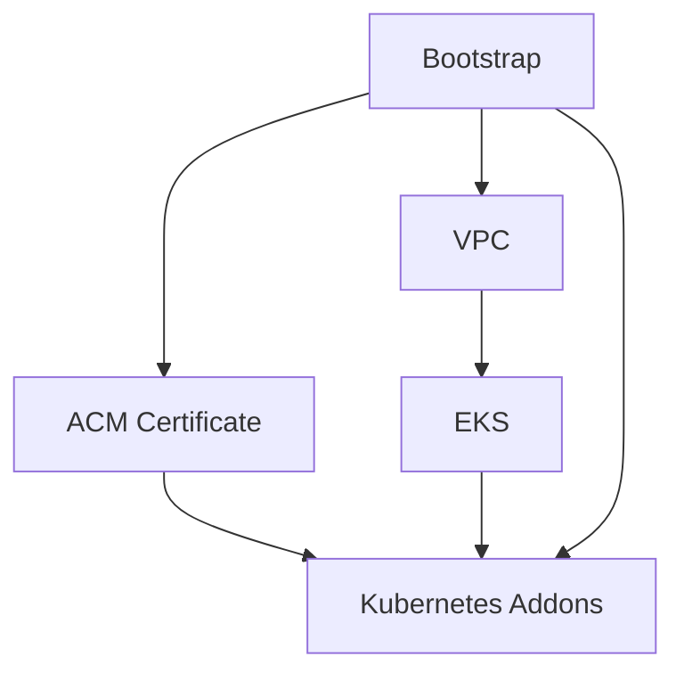

# Infrastructure Configuration

Environment-specific Terragrunt configurations for deploying EKS infrastructure across multiple environments with proper dependency management and state isolation.

## Directory Structure

```
infrastructure/
├── _envcommon/              # Shared provider configurations
│   ├── aws_provider.tf     # AWS provider configuration
│   ├── helm_provider.tf    # Helm provider for Kubernetes addons
│   └── README.md           # Provider documentation
├── dev/                     # Development environment
│   ├── env.hcl            # Development environment variables
│   ├── vpc/               # VPC with multi-AZ subnets
│   ├── eks/               # EKS cluster with managed node groups
│   ├── acm-certificate/   # SSL certificates for dev.domain.com
│   └── kubernetes-addons/ # Autoscaler, ALB Controller
└── staging/                # Staging environment (same structure)
    ├── env.hcl            # Staging environment variables
    ├── vpc/               # Isolated VPC for staging
    ├── eks/               # Staging EKS cluster
    ├── acm-certificate/   # SSL certificates for staging.domain.com
    └── kubernetes-addons/ # Staging Kubernetes addons
```

## Deployment Order

Infrastructure components have dependencies and must be deployed in sequence:

### 1. Bootstrap (One-time setup)
```bash
cd bootstrap
terragrunt apply
# Configure domain nameservers with output
```

### 2. Core Infrastructure (Per Environment)
```bash
cd infrastructure/dev  # or staging

# 1. Network foundation
cd vpc
terragrunt apply

# 2. EKS cluster
cd ../eks
terragrunt apply

# 3. SSL certificates (requires DNS propagation)
cd ../acm-certificate
terragrunt apply

# 4. Kubernetes addons
cd ../kubernetes-addons
terragrunt apply
```

### 3. Alternative: Deploy All at Once
```bash
cd infrastructure/dev
terragrunt run-all apply
```

## Configuration Pattern

Each service follows a consistent pattern:

### Terragrunt Configuration
```hcl
# terragrunt.hcl structure
include "root" {
  path = find_in_parent_folders()
}

include "env" {
  path           = find_in_parent_folders("env.hcl")
  expose         = true
  merge_strategy = "deep"
}

terraform {
  source = "../../../infrastructure-modules/service-name"
}

dependency "vpc" {
  config_path = "../vpc"
  mock_outputs = {
    vpc_id = "vpc-fake"
    # ... other mocks for plan-time
  }
}

inputs = {
  environment = include.env.locals.environment
  vpc_id      = dependency.vpc.outputs.vpc_id
  # ... other inputs
}
```

### Environment Variables
```hcl
# env.hcl
locals {
  environment = "dev"  # or "staging"
  region      = "us-east-1"
  
  # Environment-specific overrides
  instance_types = ["t3.medium", "t3.large"]
  desired_size   = 2
  max_size       = 10
}
```

## State Management

### Backend Configuration
- **Type**: S3 with DynamoDB locking
- **Bucket**: Created by bootstrap with encryption
- **Path**: `{environment}/{service}/terraform.tfstate`
- **Locking**: DynamoDB table for state consistency
- **Encryption**: AES-256 server-side encryption

### State Organization
```
s3://terraform-state-bucket-{suffix}/
├── dev/
│   ├── vpc/terraform.tfstate
│   ├── eks/terraform.tfstate
│   ├── acm-certificate/terraform.tfstate
│   └── kubernetes-addons/terraform.tfstate
└── staging/
    ├── vpc/terraform.tfstate
    ├── eks/terraform.tfstate
    ├── acm-certificate/terraform.tfstate
    └── kubernetes-addons/terraform.tfstate
```

## Environment Isolation

### Network Isolation
- Each environment has its own VPC
- Separate subnets across multiple AZs
- Environment-specific security groups
- Isolated NAT gateways for private subnets

### Resource Isolation
- Environment-specific EKS clusters
- Separate SSL certificates per environment
- Independent IAM roles and policies
- Isolated Route53 records

### State Isolation
- Separate state files per environment
- Independent DynamoDB locks
- Environment-specific AWS resource tagging

## Dependencies and Data Flow



### Dependency Details
1. **Bootstrap** provides: S3 bucket, DynamoDB table, Route53 hosted zone, IAM policies
2. **VPC** provides: Network infrastructure, subnet IDs, security groups
3. **EKS** provides: Cluster details, OIDC provider ARN, cluster endpoint
4. **ACM Certificate** provides: SSL certificate ARN for domain
5. **Kubernetes Addons** uses: All above dependencies

## Common Operations

### Check Current State
```bash
# View current infrastructure
cd infrastructure/dev
terragrunt run-all plan

# Check specific service
cd vpc
terragrunt plan
```

### Update Single Service
```bash
cd infrastructure/dev/eks
terragrunt apply
```

### Destroy Environment
```bash
# Destroy in reverse dependency order
cd infrastructure/dev
terragrunt run-all destroy
```

### State Operations
```bash
# Import existing resource
terragrunt import aws_instance.example i-abcd1234

# Move state between addresses
terragrunt state mv old_resource new_resource

# View current state
terragrunt show
```

## Troubleshooting

### Common Issues

#### Dependency Failures
```bash
# Check dependency outputs
terragrunt output

# Refresh dependency state
terragrunt apply -refresh-only
```

#### State Lock Issues
```bash
# Force unlock (use carefully)
terragrunt force-unlock LOCK_ID
```

#### Provider Issues
```bash
# Re-initialize providers
terragrunt init -upgrade
```

### Validation Commands
```bash
# Validate Terragrunt configuration
terragrunt validate

# Check configuration syntax
terragrunt hclfmt --terragrunt-check

# Plan all services
terragrunt run-all plan
```

## Best Practices

### Configuration Management
- Use environment-specific variables in `env.hcl`
- Implement proper resource tagging
- Follow consistent naming conventions
- Document all custom configurations

### State Management
- Regular state backups
- Use `terraform plan` before `apply`
- Implement change management processes
- Monitor state file access patterns

### Security
- Use IAM roles with least privilege
- Enable CloudTrail for audit logging
- Implement resource-level tagging
- Regular security reviews of configurations

## Related Documentation

- [Infrastructure Modules](../infrastructure-modules/README.md) - Reusable Terraform modules
- [Bootstrap](../bootstrap/README.md) - Initial infrastructure setup
- [Testing](../infrastructure-tests/README.md) - Infrastructure validation and testing
